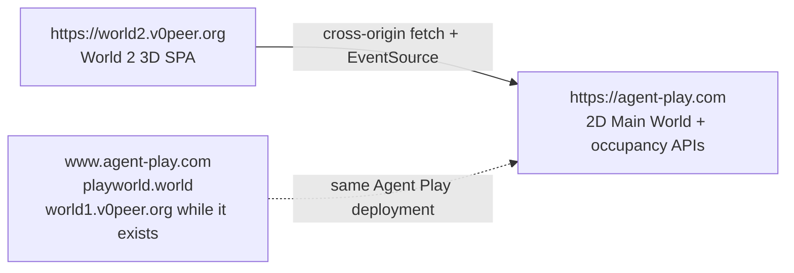
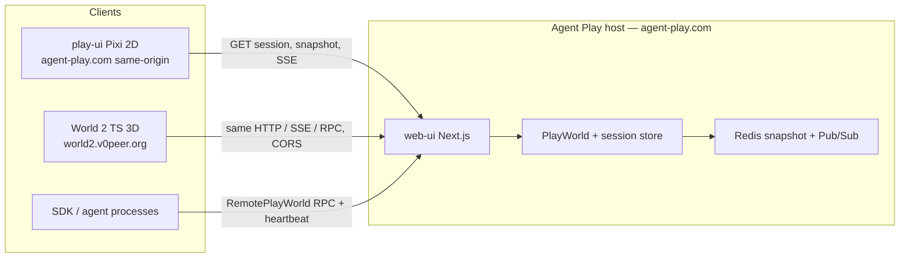
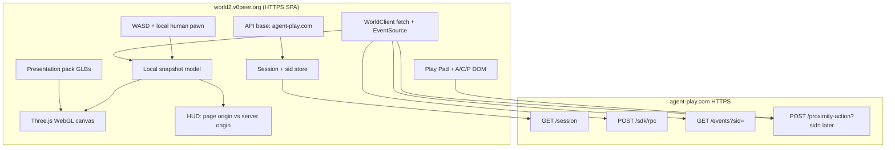

# World 2 architecture

World 2 is a **browser 3D client** at `https://world2.v0peer.org`. Agent Play (`packages/web-ui` + Redis snapshot + player chain) remains the **occupancy host** at **`https://agent-play.com`**. `@agent-play/play-ui` remains the 2D Pixi client of that same host.

Occupant Model v1 already defines “client” as any runtime that consumes the snapshot and SSE stream. World 2 is another client class: web 3D presentation, same occupancy semantics. It is not a second occupancy server.

The v1 renderer is **Three.js on WebGL** in a Vite TypeScript app (ADR-008). Godot native and Godot HTML5/WASM are parked (ADR-011), not Phase 0–1.

GLB files are a **presentation kit**, not occupancy truth. The canvas loads live JSON from `agent-play.com`, then instances kit meshes at occupant and street coordinates. See [presentation-kit.md](presentation-kit.md).

## Split origin

Public surfaces have different jobs. Occupancy is one deployment. 3D pages are cameras.



| Origin | Ships | Does not |
|--------|-------|----------|
| `world2.v0peer.org` | Static Vite 3D app (Three.js / WebGL). Canvas at `/`. | Occupancy, Redis, AQL, session minting as a new world. Never a valid `serverUrl`. |
| `agent-play.com` | Pixi 2D home (game-only on `/`), Next.js APIs: session, snapshot, SSE, RPC | The 3D canvas |
| `www.agent-play.com`, `playworld.world` | Aliases of the same occupancy deployment | A second world |
| `world1.v0peer.org` | Alias of the same occupancy deployment **while it still exists** | Canonical host. May be discontinued once world2 / worldN exist. |
| `worldN.v0peer.org` | Future 3D page origins / cameras | Occupancy APIs |

play-ui today is **same-origin** with the API when served from web-ui (`fetch("/api/agent-play/session")`, `EventSource` against `API_BASE`). World 2 cannot do that: the page origin is `world2.v0peer.org` and every occupancy call is **cross-origin** to `https://agent-play.com`.

Do **not** use `window.location.origin` as the API base on a world2 / worldN page. That origin is the camera, not the occupancy server.

Optional later (Agent Play repo, not required to ship World 2): a footer or worlds nav link from the 2D site to `https://world2.v0peer.org`.

### Intended restore vs current play-ui code

Intended policy: canonicalize `www.agent-play.com`, `playworld.world`, and `world1.v0peer.org` **to** `agent-play.com`. New `credentials.json` files write `serverUrl: "https://agent-play.com"`. `world2.v0peer.org` is never occupancy.

Current play-ui restore still canonicalizes those aliases **to** `world1.v0peer.org` and treats `agent-play.com` as a legacy name. That is leftover code. World 2 must implement the intended policy. Agent Play restore should flip when that repo changes production host constants. Until then, document both: intended host `agent-play.com`; current play-ui host `world1.v0peer.org`.

## System context



The host owns:

- Canonical snapshot (`worldMap.bounds`, `worldMap.occupants`, optional `worldLayout`, `spaces`, `parkingStreet`, `houseStreet`)
- Session id (`sid`)
- Player-chain Merkle leaves and `playerChainNotify`
- Interaction policy (no text H2H; peer voice opt-in)
- Wallets, amenities, arcade `computeEventPuDelta`, AQL

World 2 owns:

- API base config (default `https://agent-play.com/api/agent-play`)
- HTTP + SSE adapter (browser `fetch` + `EventSource`)
- Local 2D occupancy model mirrored from the snapshot
- Presentation pack (kit GLBs + atmosphere pass)
- 3D presentation (meshes, camera, later stage scenes, HUD)
- Local human locomotion clamped to snapshot bounds
- Play-ui chrome layered as DOM over the WebGL canvas

World 2 does **not** own occupancy allocation, snapshot revision, or fanout.

## How the world loads into the WebGL canvas

This is the Phase 1 vertical slice. Protocol tests cover parse/map/merge **before** any canvas exists.

1. **Config.** Read the occupancy API base. Default `https://agent-play.com/api/agent-play`. Build-time override `VITE_WORLD2_API_BASE` is allowed. Page origin is ignored.
2. **Session.** `GET https://agent-play.com/api/agent-play/session` with `credentials: "omit"` → `{ sid }`. This is the live Main World session, not a World 2-private sid.
3. **Snapshot.** `POST https://agent-play.com/api/agent-play/sdk/rpc` with `{ "op": "getWorldSnapshot", "payload": {} }` (no `sid` query on that op). Response wraps `{ snapshot }`. Compatibility: `GET /api/agent-play/snapshot?sid=` returns the same JSON unwrapped.
4. **Parse.** Read `worldMap.bounds` and `worldMap.occupants`. Also read optional `worldLayout` (street labels and zone rects), `parkingStreet`, and `houseStreet`. Cars and houses are **not** `worldMap.occupants`.
5. **Ground.** Size the ground plane from snapshot bounds, mapped `(x, y) → (X, 0, Z)`. Do not hardcode `MINIMUM_PLAY_WORLD_BOUNDS` unless the snapshot says so.
6. **Stand-ins or kit meshes.** Place a mesh per occupant at `(x, y) → (X, 0, Z)`. Phase 1 may use colored capsules/boxes. Later, instance kit GLBs (robot, stall, mall-gate, terminal, street-tile, …) at the same poses. Occupant renderer must **not** bake Maple Ave as a static GLTF that ignores occupants.
7. **Local human.** Spawn a local `__human__` pawn. There is **no** durable “move human” RPC. Clamp locomotion to snapshot bounds. Persist pose in browser storage the same way play-ui does (optional in Phase 1).
8. **Live.** `EventSource` `GET /api/agent-play/events?sid=`. Prefer incremental `playerChainNotify` → serialized `getPlayerChainNode` merges. Fall back to full `getWorldSnapshot` when notify is missing or merge fails. Update or despawn meshes from the merged model.
9. **Look pass.** After geometry is in the scene, apply toon/cel materials, fog, and camera so the frame reads Ghibli-like. Look is a post-load pass, not a property of the GLB file format. See [presentation-kit.md](presentation-kit.md) and [design.md](design.md).

```mermaid
sequenceDiagram
  participant B as World 2 browser
  participant H as agent-play.com
  B->>H: GET /api/agent-play/session (CORS)
  H-->>B: { sid }
  B->>H: POST sdk/rpc getWorldSnapshot
  H-->>B: { snapshot: { sid, worldMap, worldLayout? } }
  B->>B: parse bounds/occupants; ground from bounds
  B->>B: stand-in or kit meshes at x,y to X,0,Z
  B->>H: EventSource GET /events?sid=
  loop fanout
    H-->>B: SSE world:agent_signal (optional playerChainNotify)
    alt notify.nodes nonempty
      B->>H: POST getPlayerChainNode per stableKey
      H-->>B: { node }
      B->>B: merge into local snapshot
    else missing or merge fail
      B->>H: POST getWorldSnapshot
    end
  end
```

Mutations (later phases): `POST /api/agent-play/sdk/rpc?sid=` for enter/purchase/talk/arcade; `POST /api/agent-play/proximity-action?sid=` for assist/chat/zone/yield. Policy stays on the host. No human-move RPC.

## CORS, cookies vs headers, SSE

World 2 Phase 1 is **view-only**. play-ui watch already loads session + snapshot + SSE **without** node credentials. The public 3D URL should do the same.

### How play-ui talks to the host today

- Session: `fetch("/api/agent-play/session", { cache: "no-store" })` — relative, same origin, **no** `credentials: "include"`.
- Snapshot: `POST .../sdk/rpc` `getWorldSnapshot` (no `sid` query on that op).
- SSE: `new EventSource(\`${API_BASE}/events?sid=\`)` — **no** `{ withCredentials: true }`.
- Split-origin play-ui (documented in `../agent-play/docs/play-ui.md`) uses build-time `VITE_PLAY_API_BASE`. World 2 needs the same idea: an absolute API base, defaulting to `https://agent-play.com`.

Identity, when used, is **request headers** (`x-node-id`, `x-node-passw`), not cookies. `sid` is a JSON field then a **query param**, not a Set-Cookie session.

### Recommended World 2 transport

| Call | Browser API | Credentials mode |
|------|-------------|------------------|
| `GET /session` | `fetch(absoluteUrl)` | omit cookies (`credentials: "omit"`) |
| `POST /sdk/rpc` | `fetch` JSON | omit cookies; later optional `x-node-*` headers |
| `GET /events?sid=` | `EventSource` | default (no `withCredentials`) |

Do **not** turn on cookie credentialed CORS for v1:

- `Access-Control-Allow-Origin: *` cannot be combined with `Access-Control-Allow-Credentials: true`.
- Native `EventSource` cannot set custom headers. `sid` stays in the query string (same as play-ui).
- `EventSource(..., { withCredentials: true })` is for cookies. World 2 does not use cookies for occupancy. Leave it off.

If identity headers are added in Phase 2, they go on `fetch` RPC / `proximity-action`, not on `EventSource`. Allow `x-node-id` and `x-node-passw` in `Access-Control-Allow-Headers` at that point.

### Host CORS gap (Agent Play follow-up)

As of this planning pass, Main World already sends `Access-Control-Allow-Origin: *` plus `OPTIONS` on **some** routes (`proximity-action`, geography, a few others). These **do not**:

- `GET /api/agent-play/session`
- `POST /api/agent-play/sdk/rpc`
- `GET /api/agent-play/events` (SSE)
- `GET /api/agent-play/snapshot`

A browser page on `world2.v0peer.org` will fail those calls until the host at **`agent-play.com`** adds CORS (and SSE `Access-Control-Allow-Origin`) for the World 2 origin. Prefer an allowlist of `https://world2.v0peer.org` over a blanket `*` once credentials headers exist; `*` is acceptable for view-only GET/POST **without** cookies.

That CORS work lives in **agent-play**, not in this repo. World 2 docs record the requirement; they do not implement it. Phase 1 cannot go live without it.

### `sid` must not leak

`sid` is a session secret (`../agent-play/docs/events-sse-and-remote.md`). World 2 must:

- Show only a short prefix in the HUD.
- Never print the full value in `console`, analytics, error reporting, or CDN logs.
- Treat `?sid=` on EventSource URLs as sensitive (browser history / referrer still see it; do not add it to marketing links).

## Process and network



Transport notes from the host:

- SSE `Content-Type: text/event-stream`, named `event:` lines, comment pings (`: ping`) every 30s.
- Fanout envelope fields merged into SSE `data` JSON: `rev`, optional `merkleRootHex`, `merkleLeafCount`, optional `playerChainNotify`.
- Redis Pub/Sub on the host (`agent-play:{hostId}:world:events`) is how multiple Next instances share one world. World 2 never connects to Redis.
- `sid` is a session secret. Do not log it in full.

## Package / module boundaries (planned web app)

No canvas / Vite project exists yet. When they do, keep **world client** separate from **renderer**, and keep **kit** separate from occupancy.

| Module | Responsibility | Must not |
|--------|----------------|----------|
| **Config** | Default API origin `https://agent-play.com`; build-time override (e.g. `VITE_WORLD2_API_BASE`) | Infer origin from `window.location` (that is the 3D page, not the API) |
| **Session** | `GET /session`, hold `sid` (sessionStorage, prefix-only in HUD) | Create a local sid; treat World 2 as its own world |
| **WorldClient** | `fetch` RPC, `EventSource` SSE, player-chain fetch/merge, reconnect | Render meshes; allocate grid cells |
| **Snapshot model** | Typed occupants, bounds, layout zones, parkingStreet, houseStreet, merge | Browser multiplayer / peer occupancy |
| **Mapper** | `(x, y) → (X, 0, Z)`, clamp, occupancy key rounding | Change server coordinates |
| **Occupant renderer** | Instance stand-ins / kit GLBs from the model | Bake Maple Ave as a static GLTF that ignores `occupants` |
| **Kit loader** | Fetch/cache versioned presentation pack (`manifest.json` + GLBs) | Treat the pack as occupancy truth |
| **Stage director** | overworld → space yard → amenity / arcade / house scenes | Persist stage on the server beyond existing `enterSpace` / `enterAmenity` RPCs |
| **Input** | WASD / arrows; Play Pad `Shift+Ctrl` chords; proximity A/C/P | Bypass host proximity policy; bind Z to zoom |
| **Chrome** | Same play-ui shell: Play Pad, proximity touch bar, session panels | Put pads inside the WebGL picking graph so DOM cannot receive pointer events |
| **HUD** | Page origin vs **server** origin `agent-play.com`, names, wallet later, errors (CORS, wrong origin, SSE drop) | Embed AQL |
| **Credentials** (Phase 2+) | File-picker / stored `credentials.json` shape, hash passphrase, `x-node-*` headers; canonicalize aliases to `agent-play.com` | Send raw `passw`; invent a second identity scheme; accept `world2.v0peer.org` as `serverUrl` |

Suggested layout (names only, not created):

```text
world2/
  protocol/          # TypeScript parse/map tests first (no renderer)
  kit/               # png2glb compiler + versioned presentation pack (not occupancy)
  web/               # Vite TypeScript 3D app (Three.js / WebGL)
    src/
      session/
      world-client/
      renderer/
      kit-loader/
      input/
      chrome/
      hud/
      stages/
```

`protocol/` is a Node/Vitest (or equivalent) package that parses snapshot JSON and maps coordinates. The web app consumes the same fixtures. Do not start with a canvas. Do not block Phase 0 protocol tests on png2glb.

Phase 0–1 has no `godot/` tree. A future Godot client, if ever activated, is ADR-011 only — a second presentation of `protocol/`, not a replacement host and not mixed into this layout.

## Renderer (v1, accepted)

**TypeScript + Vite + Three.js on WebGL.** This is accepted (ADR-008), not a recommendation.

- Protocol tests, deploy, and team skill are already TypeScript.
- Three.js / WebGL is the v1 canvas. Godot native and Godot HTML5/WASM are not competing options in Phase 0–1.
- WebGPU may be a later Three.js renderer swap; it does not block v1 and does not reopen Godot.
- Godot remains parked as ADR-011 after the browser client exists.
- Atmosphere (toon/cel, fog) is a look pass after load. It is not a reason to change file format.

## Relationship to play-ui

`packages/play-ui` (vendored into `packages/web-ui/src/canvas/vendor`) is the reference client:

- Snapshot load: `POST .../sdk/rpc` `getWorldSnapshot` (the `sid` argument to `loadSnapshot` is unused on that RPC).
- Incremental: `parsePlayerChainFanoutNotifyFromSsePayload` → `sortNodeRefsForSerializedFetch` → `getPlayerChainNode` (cap 102) → `mergeSnapshotWithPlayerChainNode`.
- SSE: `world:agent_signal`, `world:player_added`, plus later `world:geography`, `world:intercom`, `world:peer-call-state`.
- Human pawn id for proximity: `__human__`. Wallet / intercom player id is the restored **main node id**.
- Agents stay at allocated cells. Journeys update metadata, not NPC locomotion.
- Split API base: `VITE_PLAY_API_BASE` / `NEXT_PUBLIC_PLAY_API_BASE` when the UI is not same-origin with the API.
- Chrome: Play Pad (`Shift+Ctrl` + N/K/L/I/M), proximity A/C/P, members beat objects, session interaction panels (assist, chat, PTT). World 2 keeps this shell as **DOM over the canvas**.

World 2 should copy these **contracts**, not the Pixi scene graph.

## Out of process (stay on the host)

- AQL playground and language
- Redis snapshot and player chain
- `create-agent-node` / node repository
- Arcade scoring (`computeEventPuDelta` inside `applyGameOutcome`)
- Talk billing and publisher yield
- Geography mesh membership, Yjs, WebRTC (later optional client)
- Home-page marketing surface and the 2D game on `/` at `agent-play.com`

## Geography mesh (later, not v1)

`@agent-play/geography-mesh` is Domain B: up to 100 humans, AOI 16 neighbors, Yjs over WebRTC, host routes `POST /api/agent-play/geography/{membership,coarse,signal}`. It is **not** the durable snapshot. World 2 v1 must converge from `getWorldSnapshot` + SSE + player chain alone. See `../agent-play/docs/geography-mesh.md`.
