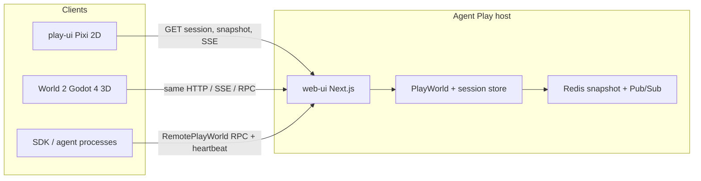
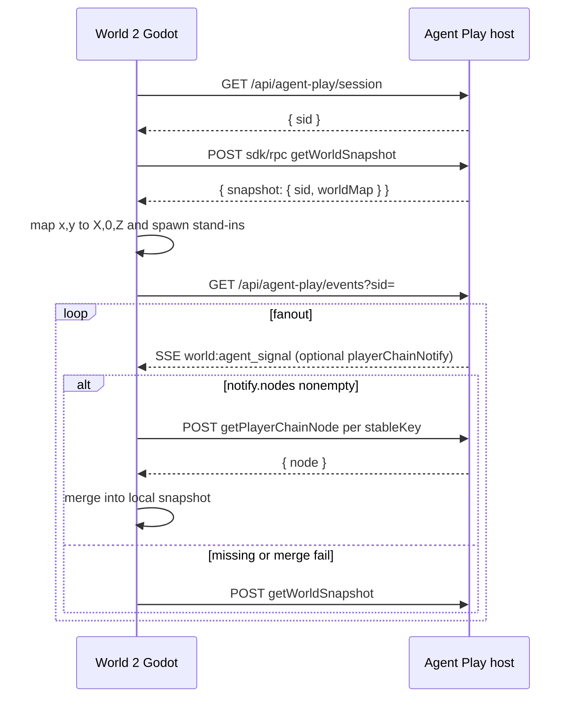
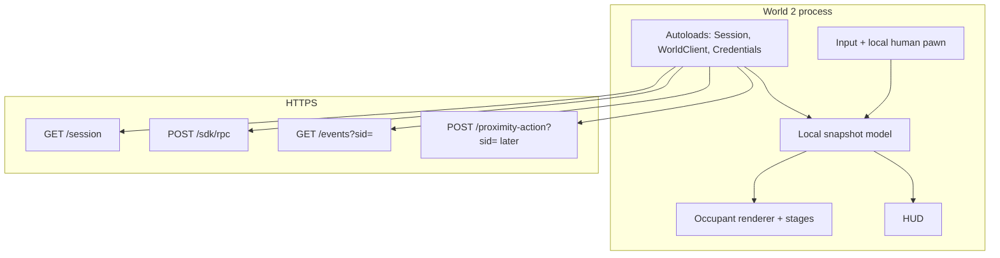

# World 2 architecture

World 2 is a Godot 4 **client**. Agent Play (`packages/web-ui` + Redis snapshot + player chain) remains the **host**. `@agent-play/play-ui` remains the 2D Pixi client of that same host.

Occupant Model v1 already defines “client” as any runtime that consumes the snapshot and SSE stream. World 2 is a third client class: native desktop, 3D presentation, same occupancy semantics.

## System context



The host owns:

- Canonical snapshot (`worldMap.bounds`, `worldMap.occupants`, optional `worldLayout`, `spaces`)
- Session id (`sid`)
- Player-chain Merkle leaves and `playerChainNotify`
- Interaction policy (no text H2H; peer voice opt-in)
- Wallets, amenities, arcade `computeEventPuDelta`, AQL

World 2 owns:

- Credentials file load (desktop path), hashed auth headers
- HTTP + SSE adapter
- Local 2D occupancy model mirrored from the snapshot
- 3D presentation (meshes, camera, stage scenes, HUD)
- Local human locomotion clamped to snapshot bounds

World 2 does **not** own occupancy allocation, snapshot revision, or fanout.

## Data flow

1. **Session.** `GET https://world1.v0peer.org/api/agent-play/session` → `{ sid }`. This is the live Main World session, not a World 2-private sid.
2. **Snapshot.** `POST /api/agent-play/sdk/rpc` with `{ "op": "getWorldSnapshot", "payload": {} }` (no `sid` query). Response wraps `{ snapshot }`. Compatibility: `GET /api/agent-play/snapshot?sid=` returns the same JSON unwrapped.
3. **Ingest.** Parse `worldMap.bounds` + `worldMap.occupants`. Map each occupant `(x, y)` to Godot `(X, 0, Z)`. Spawn stand-in meshes by `kind`.
4. **Live.** `GET /api/agent-play/events?sid=` SSE. Prefer incremental `playerChainNotify` → serialized `getPlayerChainNode` merges. Fall back to full `getWorldSnapshot` when notify is missing or merge fails.
5. **Local human.** The 2D watch UI moves `__human__` on the client and persists pose in browser storage. There is **no durable “move human” RPC** on the occupancy snapshot. World 2 Phase 1 matches that: clamp a local pawn to bounds. Optional geography-mesh coarse POST is later, not v1.
6. **Mutations (later phases).** `POST /api/agent-play/sdk/rpc?sid=` for enter/purchase/talk/arcade; `POST /api/agent-play/proximity-action?sid=` for assist/chat/zone/yield. Policy stays on the host.



## Process and network



Transport notes from the host:

- SSE `Content-Type: text/event-stream`, named `event:` lines, comment pings (`: ping`) every 30s.
- Fanout envelope fields merged into SSE `data` JSON: `rev`, optional `merkleRootHex`, `merkleLeafCount`, optional `playerChainNotify`.
- Redis Pub/Sub on the host (`agent-play:{hostId}:world:events`) is how multiple Next instances share one world. World 2 never connects to Redis.
- `sid` is a session secret. Do not log it in full.

## Package / module boundaries (planned Godot)

No `.tscn` / `.gd` files exist yet. When they do, keep **world client** separate from **renderer**.

| Module | Responsibility | Must not |
|--------|----------------|----------|
| **Credentials** (autoload) | Load `credentials.json`, hash passphrase with the same material function the SDK uses, expose `x-node-id` / `x-node-passw` | Send raw `passw` on the wire; invent a second identity scheme |
| **Session** (autoload) | Origin config (default Main World), `GET /session`, hold `sid` | Create a local sid; treat World 2 as its own world |
| **WorldClient** (autoload) | HTTP RPC, SSE, player-chain fetch/merge, reconnect | Render meshes; allocate grid cells |
| **Snapshot model** | Typed occupants, bounds, layout zones, merge | Godot `MultiplayerSpawner` / peer authority |
| **Mapper** | `(x, y) → (X, 0, Z)`, clamp, occupancy key rounding | Change server coordinates |
| **Occupant renderer** | Instance stand-ins / later meshes from the model | Bake Maple Ave as a static GLTF that ignores `occupants` |
| **Stage director** | overworld → space yard → amenity / arcade / house scenes | Persist stage on the server beyond existing `enterSpace` / `enterAmenity` RPCs |
| **Input** | WASD / arrows (native); later Play Pad `Shift+Ctrl` chords | Bypass host proximity policy |
| **HUD** | Names, wallet later, errors (wrong origin, lost credentials, SSE drop) | Embed AQL |

Suggested Godot layout (names only, not created):

```text
world2/
  protocol/          # TypeScript parse/map tests first (no Godot)
  godot/             # Godot 4 project later
    autoload/
    world_client/
    renderer/
    input/
    hud/
    stages/
```

`protocol/` is a Node/Vitest (or equivalent) package that parses snapshot JSON and maps coordinates. Godot consumes the same fixtures. Do not start with scenes.

## Relationship to play-ui

`packages/play-ui` (vendored into `packages/web-ui/src/canvas/vendor`) is the reference client:

- Snapshot load: `POST .../sdk/rpc` `getWorldSnapshot` (the `sid` argument to `loadSnapshot` is unused on that RPC).
- Incremental: `parsePlayerChainFanoutNotifyFromSsePayload` → `sortNodeRefsForSerializedFetch` → `getPlayerChainNode` (cap 102) → `mergeSnapshotWithPlayerChainNode`.
- SSE: `world:agent_signal`, `world:player_added`, plus later `world:geography`, `world:intercom`, `world:peer-call-state`.
- Human pawn id for proximity: `__human__`. Wallet / intercom player id is the restored **main node id**.
- Agents stay at allocated cells. Journeys update metadata, not NPC locomotion.

World 2 should copy these contracts, not the Pixi scene graph.

## Out of process (stay on the host)

- AQL playground and language
- Redis snapshot and player chain
- `create-agent-node` / node repository
- Arcade scoring (`computeEventPuDelta` inside `applyGameOutcome`)
- Talk billing and publisher yield
- Geography mesh membership, Yjs, WebRTC (later optional client)
- Home-page marketing surface

## Geography mesh (later, not v1)

`@agent-play/geography-mesh` is Domain B: up to 100 humans, AOI 16 neighbors, Yjs over WebRTC, host routes `POST /api/agent-play/geography/{membership,coarse,signal}`. It is **not** the durable snapshot. World 2 v1 must converge from `getWorldSnapshot` + SSE + player chain alone. See `../agent-play/docs/geography-mesh.md`.
