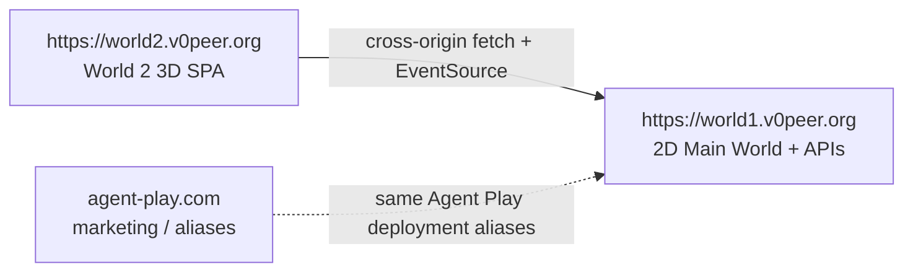
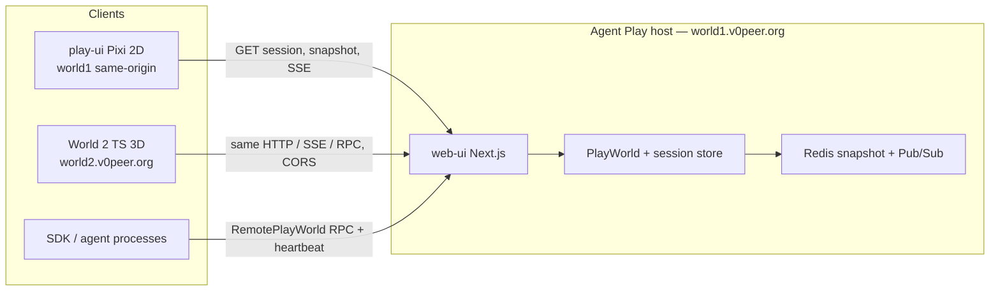
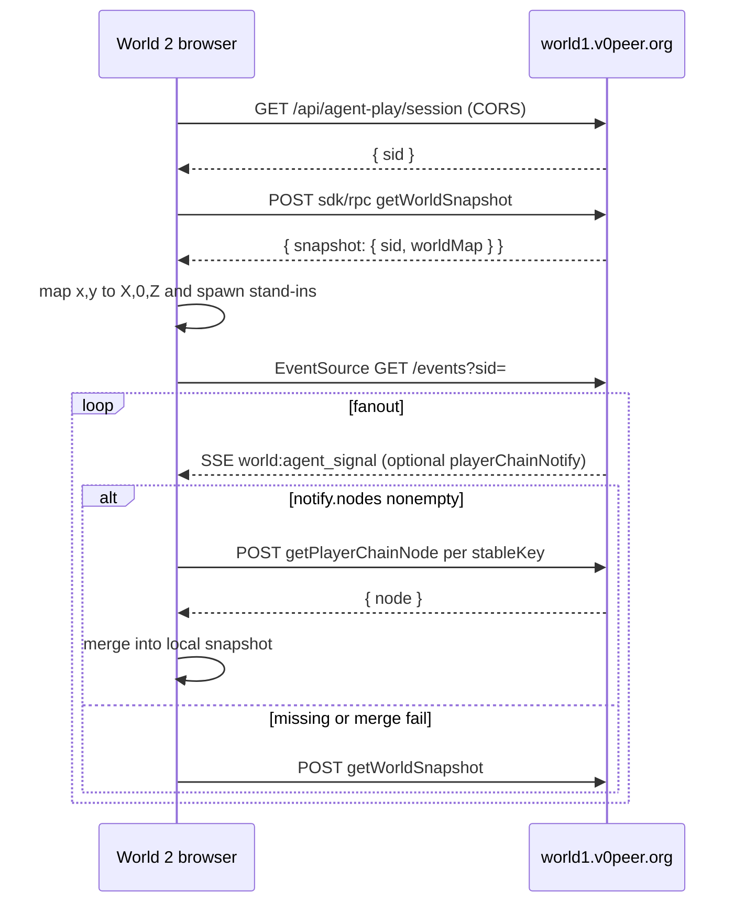
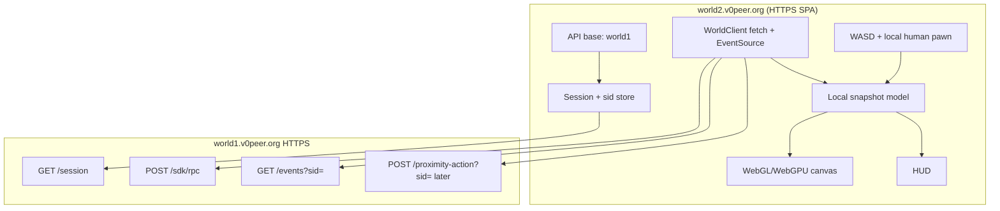

# World 2 architecture

World 2 is a **browser 3D client** at `https://world2.v0peer.org`. Agent Play (`packages/web-ui` + Redis snapshot + player chain) remains the **host** at `https://world1.v0peer.org`. `@agent-play/play-ui` remains the 2D Pixi client of that same host.

Occupant Model v1 already defines “client” as any runtime that consumes the snapshot and SSE stream. World 2 is another client class: web 3D presentation, same occupancy semantics. It is not a second occupancy server.

Native Godot 4 / Vulkan desktop is **later / optional**, not the v1 ship. See [decisions.md](decisions.md) ADR-008.

## Split origin

Three public surfaces, three jobs:



| Origin | Ships | Does not |
|--------|-------|----------|
| `world2.v0peer.org` | Static Vite (or similar) 3D app. Canvas at `/`. | Occupancy, Redis, AQL, session minting as a new world |
| `world1.v0peer.org` | Pixi 2D home, Next.js APIs: session, snapshot, SSE, RPC | The 3D canvas |
| `agent-play.com` | Marketing / legacy names for the Agent Play deployment | World 2 |

play-ui today is **same-origin** with the API when served from web-ui (`fetch("/api/agent-play/session")`, `EventSource` against `API_BASE`). World 2 cannot do that: the page origin is `world2.v0peer.org` and every occupancy call is **cross-origin** to `world1.v0peer.org`.

Optional later (Agent Play repo, not required to ship World 2): a footer or worlds nav link from the 2D site to `https://world2.v0peer.org`.

## System context



The host owns:

- Canonical snapshot (`worldMap.bounds`, `worldMap.occupants`, optional `worldLayout`, `spaces`)
- Session id (`sid`)
- Player-chain Merkle leaves and `playerChainNotify`
- Interaction policy (no text H2H; peer voice opt-in)
- Wallets, amenities, arcade `computeEventPuDelta`, AQL

World 2 owns:

- API base config (default `https://world1.v0peer.org/api/agent-play`)
- HTTP + SSE adapter (browser `fetch` + `EventSource`)
- Local 2D occupancy model mirrored from the snapshot
- 3D presentation (meshes, camera, later stage scenes, HUD)
- Local human locomotion clamped to snapshot bounds

World 2 does **not** own occupancy allocation, snapshot revision, or fanout.

## CORS, cookies vs headers, SSE

World 2 Phase 1 is **view-only**. play-ui watch already loads session + snapshot + SSE **without** node credentials. The public 3D URL should do the same.

### How play-ui talks to the host today

- Session: `fetch("/api/agent-play/session", { cache: "no-store" })` — relative, same origin, **no** `credentials: "include"`.
- Snapshot: `POST .../sdk/rpc` `getWorldSnapshot` (no `sid` query on that op).
- SSE: `new EventSource(\`${API_BASE}/events?sid=\`)` — **no** `{ withCredentials: true }`.
- Split-origin play-ui (documented in `../agent-play/docs/play-ui.md`) uses build-time `VITE_PLAY_API_BASE`. World 2 needs the same idea: an absolute API base, defaulting to Main World.

Identity, when used, is **request headers** (`x-node-id`, `x-node-passw`), not cookies. `sid` is a JSON field then a **query param**, not a Set-Cookie session.

### Recommended World 2 transport

| Call | Browser API | Credentials mode |
|------|-------------|------------------|
| `GET /session` | `fetch(absoluteUrl)` | omit cookies (`credentials: "omit"`) |
| `POST /sdk/rpc` | `fetch` JSON | omit cookies; later optional `x-node-*` headers |
| `GET /events?sid=` | `EventSource` | default (no `withCredentials`) |

Do **not** turn on cookie credentialed CORS for v1:

- `Access-Control-Allow-Origin: *` cannot be combined with `Access-Control-Allow-Credentials: true`.
- Native `EventSource` cannot set custom headers. `sid` stays in the query string (same as play-ui).
- `EventSource(..., { withCredentials: true })` is for cookies. World 2 does not use cookies for occupancy. Leave it off.

If identity headers are added in Phase 2, they go on `fetch` RPC / `proximity-action`, not on `EventSource`. Allow `x-node-id` and `x-node-passw` in `Access-Control-Allow-Headers` at that point.

### Host CORS gap (Agent Play follow-up)

As of this planning pass, Main World already sends `Access-Control-Allow-Origin: *` plus `OPTIONS` on **some** routes (`proximity-action`, geography, a few others). These **do not**:

- `GET /api/agent-play/session`
- `POST /api/agent-play/sdk/rpc`
- `GET /api/agent-play/events` (SSE)
- `GET /api/agent-play/snapshot`

A browser page on `world2.v0peer.org` will fail those calls until the host adds CORS (and SSE `Access-Control-Allow-Origin`) for World 2. Prefer an allowlist of `https://world2.v0peer.org` over a blanket `*` once credentials headers exist; `*` is acceptable for view-only GET/POST **without** cookies.

That CORS work lives in **agent-play**, not in this repo. World 2 docs record the requirement; they do not implement it.

### `sid` must not leak

`sid` is a session secret (`../agent-play/docs/events-sse-and-remote.md`). World 2 must:

- Show only a short prefix in the HUD.
- Never print the full value in `console`, analytics, error reporting, or CDN logs.
- Treat `?sid=` on EventSource URLs as sensitive (browser history / referrer still see it; do not add it to marketing links).

## Data flow

1. **Session.** `GET https://world1.v0peer.org/api/agent-play/session` → `{ sid }`. This is the live Main World session, not a World 2-private sid.
2. **Snapshot.** `POST /api/agent-play/sdk/rpc` with `{ "op": "getWorldSnapshot", "payload": {} }` (no `sid` query). Response wraps `{ snapshot }`. Compatibility: `GET /api/agent-play/snapshot?sid=` returns the same JSON unwrapped.
3. **Ingest.** Parse `worldMap.bounds` + `worldMap.occupants`. Map each occupant `(x, y)` to scene `(X, 0, Z)`. Spawn stand-in meshes by `kind`.
4. **Live.** `GET /api/agent-play/events?sid=` SSE. Prefer incremental `playerChainNotify` → serialized `getPlayerChainNode` merges. Fall back to full `getWorldSnapshot` when notify is missing or merge fails.
5. **Local human.** The 2D watch UI moves `__human__` on the client and persists pose in browser storage. There is **no durable “move human” RPC** on the occupancy snapshot. World 2 Phase 1 matches that: clamp a local pawn to bounds. Optional geography-mesh coarse POST is later, not v1.
6. **Mutations (later phases).** `POST /api/agent-play/sdk/rpc?sid=` for enter/purchase/talk/arcade; `POST /api/agent-play/proximity-action?sid=` for assist/chat/zone/yield. Policy stays on the host.



## Process and network



Transport notes from the host:

- SSE `Content-Type: text/event-stream`, named `event:` lines, comment pings (`: ping`) every 30s.
- Fanout envelope fields merged into SSE `data` JSON: `rev`, optional `merkleRootHex`, `merkleLeafCount`, optional `playerChainNotify`.
- Redis Pub/Sub on the host (`agent-play:{hostId}:world:events`) is how multiple Next instances share one world. World 2 never connects to Redis.
- `sid` is a session secret. Do not log it in full.

## Package / module boundaries (planned web app)

No canvas / Vite project exists yet. When they do, keep **world client** separate from **renderer**.

| Module | Responsibility | Must not |
|--------|----------------|----------|
| **Config** | Default API origin `https://world1.v0peer.org`; build-time override (e.g. `VITE_WORLD2_API_BASE`) | Infer origin from `window.location` (that is the 3D page, not the API) |
| **Session** | `GET /session`, hold `sid` (sessionStorage, prefix-only in HUD) | Create a local sid; treat World 2 as its own world |
| **WorldClient** | `fetch` RPC, `EventSource` SSE, player-chain fetch/merge, reconnect | Render meshes; allocate grid cells |
| **Snapshot model** | Typed occupants, bounds, layout zones, merge | Browser multiplayer / peer occupancy |
| **Mapper** | `(x, y) → (X, 0, Z)`, clamp, occupancy key rounding | Change server coordinates |
| **Occupant renderer** | Instance stand-ins / later meshes from the model | Bake Maple Ave as a static GLTF that ignores `occupants` |
| **Stage director** | overworld → space yard → amenity / arcade / house scenes | Persist stage on the server beyond existing `enterSpace` / `enterAmenity` RPCs |
| **Input** | WASD / arrows; later Play Pad `Shift+Ctrl` chords; pointer lock optional later | Bypass host proximity policy |
| **HUD** | Names, wallet later, errors (CORS, wrong origin, SSE drop) | Embed AQL |
| **Credentials** (Phase 2+) | File-picker / stored `credentials.json` shape, hash passphrase, `x-node-*` headers | Send raw `passw`; invent a second identity scheme |

Suggested layout (names only, not created):

```text
world2/
  protocol/          # TypeScript parse/map tests first (no renderer)
  web/               # Vite (or similar) 3D app later
    src/
      session/
      world-client/
      renderer/
      input/
      hud/
      stages/
```

`protocol/` is a Node/Vitest (or equivalent) package that parses snapshot JSON and maps coordinates. The web app consumes the same fixtures. Do not start with a canvas.

Godot 4 desktop, if still wanted later, is a **second presentation** of `protocol/`, not a replacement host. Suggested future tree `godot/` is out of v1.

## Renderer choice (v1)

Recommend **TypeScript + Three.js (WebGL)** in a Vite SPA. Full comparison and the ADR are in [decisions.md](decisions.md) (ADR-008). Short version:

- Protocol tests, deploy, and team skill are already TypeScript.
- Three.js / WebGL is the most shippable 3D path in browsers today.
- WebGPU is the right long-term GPU API; Safari is still uneven — do not block v1 on it.
- Godot 4 HTML5 export is possible but a heavy WASM download with a weaker SSE/HTTP story. Not the priority path.
- Godot 4 native / Vulkan remains optional after the browser client exists.

## Relationship to play-ui

`packages/play-ui` (vendored into `packages/web-ui/src/canvas/vendor`) is the reference client:

- Snapshot load: `POST .../sdk/rpc` `getWorldSnapshot` (the `sid` argument to `loadSnapshot` is unused on that RPC).
- Incremental: `parsePlayerChainFanoutNotifyFromSsePayload` → `sortNodeRefsForSerializedFetch` → `getPlayerChainNode` (cap 102) → `mergeSnapshotWithPlayerChainNode`.
- SSE: `world:agent_signal`, `world:player_added`, plus later `world:geography`, `world:intercom`, `world:peer-call-state`.
- Human pawn id for proximity: `__human__`. Wallet / intercom player id is the restored **main node id**.
- Agents stay at allocated cells. Journeys update metadata, not NPC locomotion.
- Split API base: `VITE_PLAY_API_BASE` / `NEXT_PUBLIC_PLAY_API_BASE` when the UI is not same-origin with the API.

World 2 should copy these **contracts**, not the Pixi scene graph.

## Out of process (stay on the host)

- AQL playground and language
- Redis snapshot and player chain
- `create-agent-node` / node repository
- Arcade scoring (`computeEventPuDelta` inside `applyGameOutcome`)
- Talk billing and publisher yield
- Geography mesh membership, Yjs, WebRTC (later optional client)
- Home-page marketing surface and the 2D game on `/`

## Geography mesh (later, not v1)

`@agent-play/geography-mesh` is Domain B: up to 100 humans, AOI 16 neighbors, Yjs over WebRTC, host routes `POST /api/agent-play/geography/{membership,coarse,signal}`. It is **not** the durable snapshot. World 2 v1 must converge from `getWorldSnapshot` + SSE + player chain alone. See `../agent-play/docs/geography-mesh.md`.
